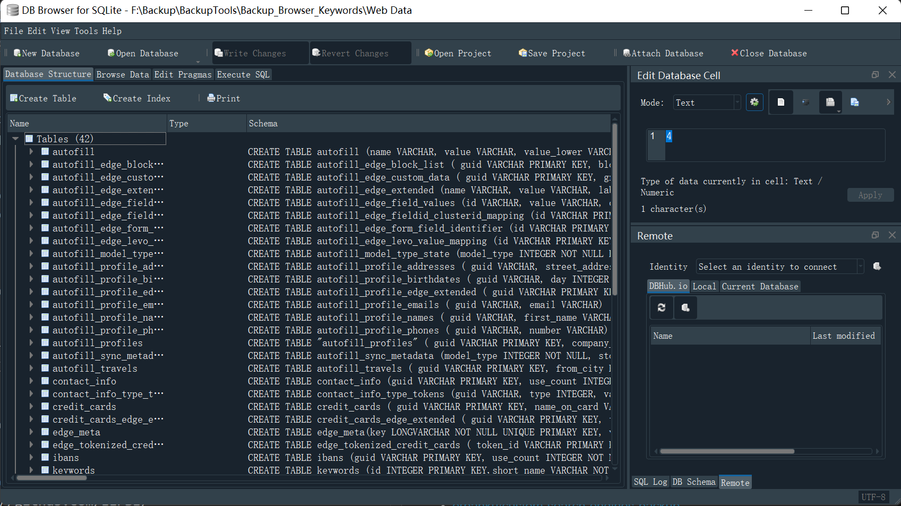
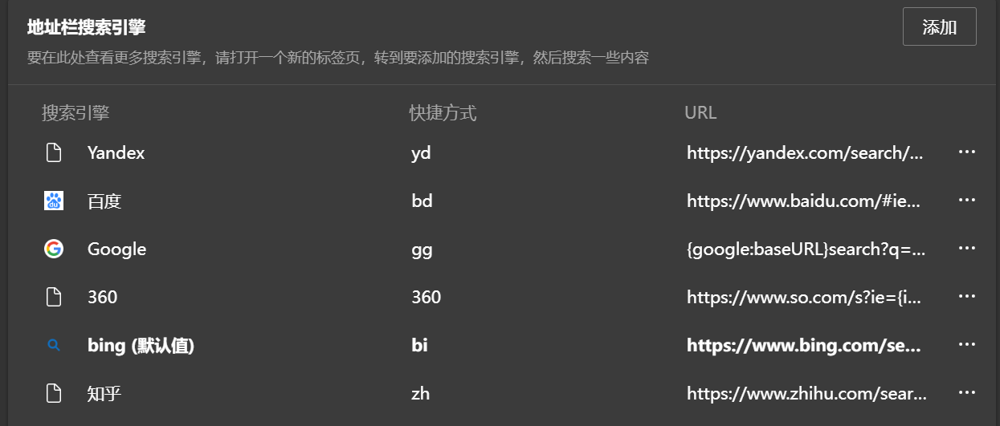

# Export_Import_Browser_Keywords

> Batch scripts to help users export and import a browser keywords(e.g. Microsoft Edge and Chrome).

## Overview
**Edge**
- Edge Custom Search Engines Settings URL: [edge://settings/searchEngines](edge://settings/searchEngines)
- Edge User Profile Directory: `%LOCALAPPDATA%\Microsoft\Edge\Default`
- Edge Database: `%LOCALAPPDATA%\Microsoft\Edge\Default\Web Data`

**Chrome**
- Chrome Custom Search Engines Settings URL: [chrome://settings/searchEngines](chrome://settings/searchEngines)
- Chrome User Profile Directory: `%LOCALAPPDATA%\Google\Chrome\User Data\Default`
- Chrome Database: `%LOCALAPPDATA%\Google\Chrome\User Data\Default\Web Data`
  
Both Edge and Chrome `keywords` table is held withing the `sqlite` database mentioned above.

## Scripts
[Export_Import_Browser_Keywords.bat](Export_Import_Browser_Keywords.bat): 
- **EXPORT** a browser's `keywords` (custom `searchEngines`) to a `SQL` file and a `CSV` file using `sqlite3`. 
- **IMPORT** a browser's `keywords` (custom `searchEngines`) from a `SQL` file using `sqlite3`. 
- The config file is [BrowserPath.ini](BrowserPath.ini).

## SQL

Output `.sql` files are exported to `output/keywords.sql`. This same `SQL` script can be used for importing back into Edge or Chrome.

Note that all scripts rely on a dependency for having `sqlite3`. You can use the file `sqlite3.exe` or easy install it via `scoop`:

```batch
scoop install sqlite
```

Another useful tool for viewing the `Web Data` database contents is [sqlitebrowser]() which can be installed via:

```batch
scoop install sqlitebrowser
```


## Current Search Engines


## Thanks
This project was inspired by:
- [erbanku/custom-search-engines-backup](https://github.com/erbanku/custom-search-engines-backup)
- [jimbrig/PSEdgeTools](https://github.com/jimbrig/PSEdgeTools)

## License
[MIT](https://github.com/ELPSI/Export_Import_Browser_Keywords/blob/main/LICENSE)


